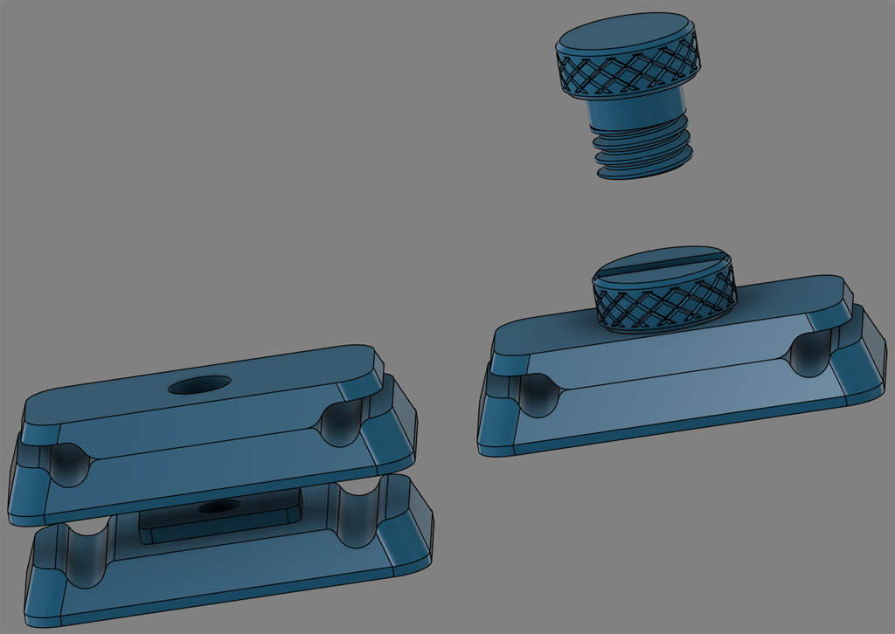
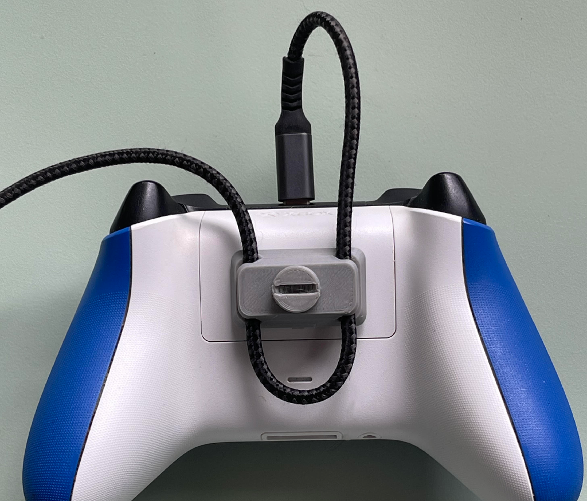

# Controller Cable Strain Relief

Mount using 3M double-sided mounting squares or glue. Using the mounting squares holds well, but is also easy to remove and clean up. I finger tighten and only use a coin for loosening if needed.

---

